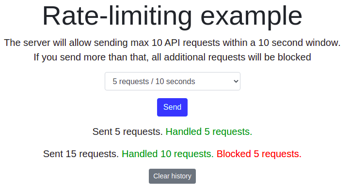

# Basic redis rate limiting demo Ruby

The server will allow sending particular number of requests (`permitted_requests_count` stored in Redis) within a 10 second window. If you send more than that, all additional requests will be blocked.



## How it works
This app was built using `rack-defense` gem which will block connections from a client after surpassing certain amount of requests (`permitted_requests_count`, default: 10) per time (10 seconds).

The application will return response headers after each successful request:

```sh
# example
X-RateLimit-Limit: 10
X-RateLimit-Remaining: 9
```

The application will also return request header after each request (including blocking requests) with count of remaining requests:

```sh
# example
RateLimit-Remaining: 1
```

### How the data is stored:

The `permitted_requests_count` is stored in Redis store in string format. By default, it's `10`. You can set new `VALUE` with these commands:

```sh
 SET permitted_requests_count VALUE
 INCR permitted_requests_count
 DECR permitted_requests_count
```

#### IMPORTANT! For the new `permitted_requests_count` value to take effect you need to restart an app (rails) server after these commands.

### How the data is accessed:

You can get `permitted_requests_count` with this command:
```sh
 GET permitted_requests_count
```

## How to run it locally?

### Prerequisites

- Ruby - v2.7.0
- Rails - v5.2.4.5
- PostgreSQL - v10.16
- NPM - v7.6.0

### Local installation:

#### Run commands:

```sh
# copy files and set proper data inside
cp config/application.yml.example config/application.yml

- REDIS_ENDPOINT_URI: Redis server URI

cp config/database.yml.example config/database.yml
```

```sh
bundle install
rails db:create
```

#### Run the app

```sh
rails s
```

#### Go to the browser with this link (localhost example)

```sh
http://localhost:3000
```

## Deployment

To make deploys work, you need to create free account in https://redislabs.com/try-free/ and get Redis instance information - REDIS_ENDPOINT_URI. You must pass it as environmental variable (in `application.yml` file or by server config, like `Heroku Config Variables`).

### Google Cloud Run

[](https://deploy.cloud.run/?git_repo=https://github.com/redis-developer/basic-redis-rate-limiting-demo-ruby.git)

### Heroku

[](https://heroku.com/deploy)
